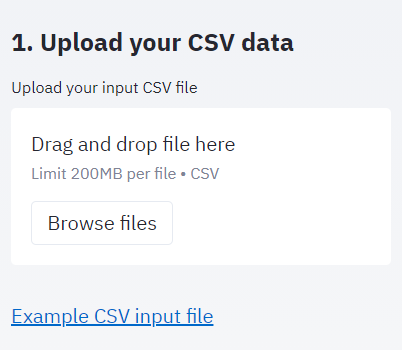
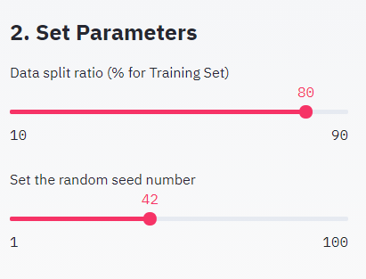
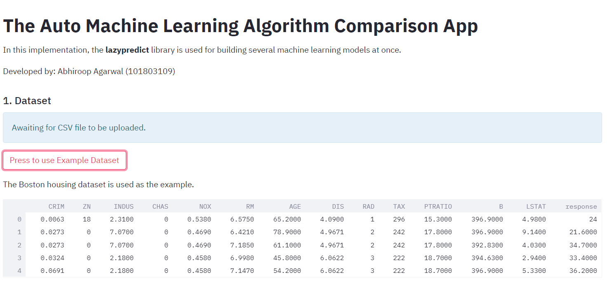
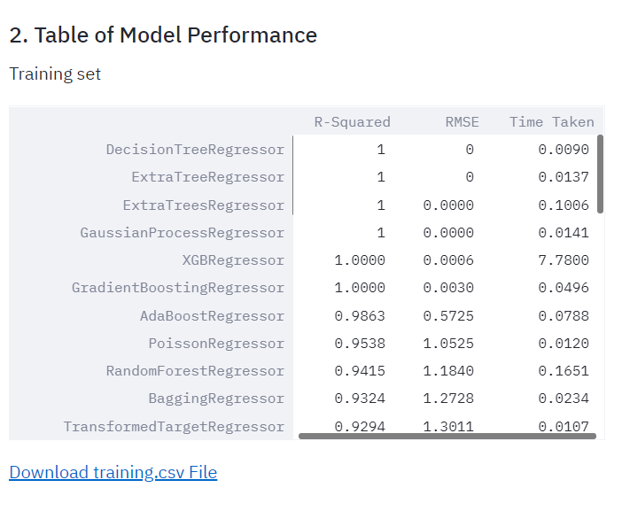
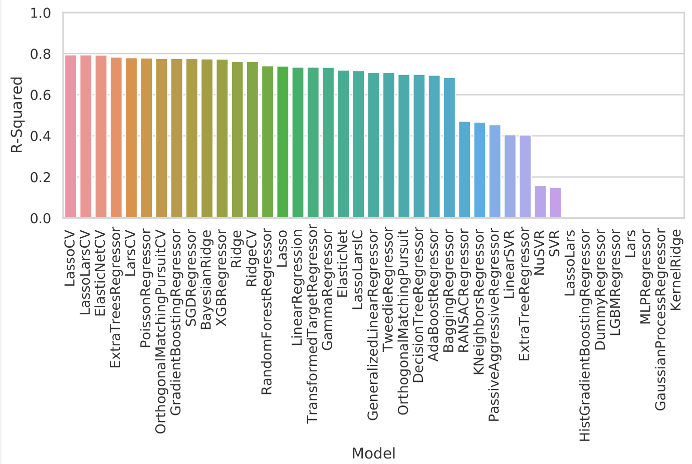
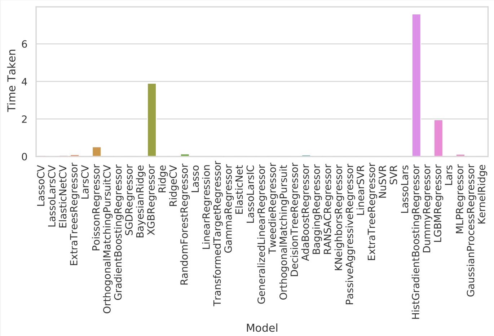
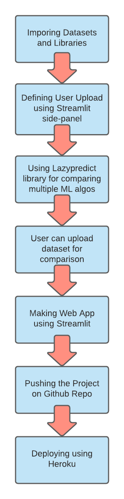

# The Auto Machine Learning Algorithm Comparison App
A web app to perform multiple machine learning alogortihms on user uploaded file.

The app can be visited at https://auto-ml-compare-app.herokuapp.com/

# About the App
This app is able to provide detailed comparison of multiple machine learning models on user uploaded file using **lazypredict** library. Bouston house dataset is used for illustration. Wine quality dataset has also been provided in the app.

The App includes:
- Overview of Dataset
- Option to upload your own dataset
- Sliders of changing the set parameters:
  - Data split ratio
  - Random seed number
- Detailed description of ML algorithm used
- Comparison criteria:
  - R-Square
  - RMSE
  - Calculation Time
- Option to download training, test files along with R2, RMSE and time taken plots

# Screenshots of the web app:

<table style="width:100%">
  <tr>
    <th></th>
    <th></th>
  </tr>
  <tr>
    <th></th>
    <th></th>
  </tr>
  <tr>
    <th></th>
    <th></th>
  </tr>
 </table>
 
 
 # Flow Chart
 
 <table style="width:100%" align="center">
  <tr>
    <th></th>
  </tr>
 </table>

#  Data Source

Wine Quality Dataset from the UCI Machine Learning Repository.

P. Cortez, A. Cerdeira, F. Almeida, T. Matos and J. Reis.
Modeling wine preferences by data mining from physicochemical properties. In Decision Support Systems, Elsevier, 47(4):547-553, 2009.
 